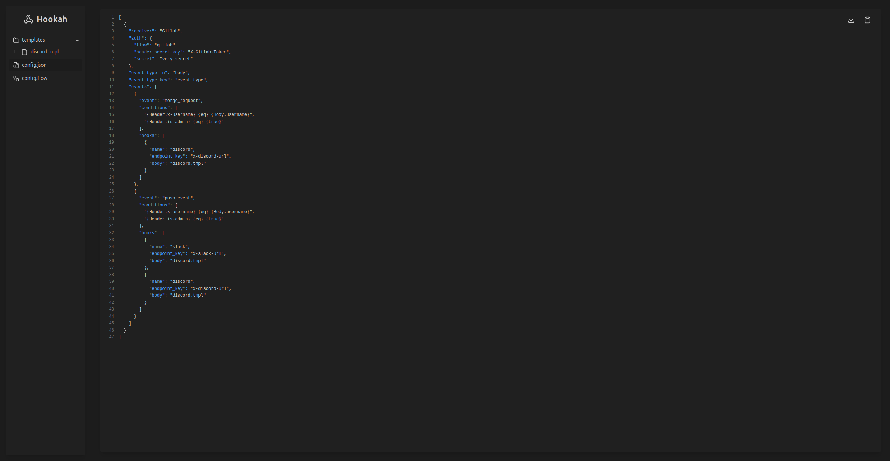

# Hookah UI - Flow Builder

This is a visual configuration builder for the [Hookah](https://github.com/AdamShannag/hookah) project. It allows users
to create a structured configuration
file (`config.json`) and related template files using a drag-and-drop user interface. The goal is to make creating and
managing hooks, events, and conditional flows both intuitive and user-friendly.

Features
------

- Drag-and-drop interface for creating hook configurations
- Support for different node types including:
    - Receiver
    - Auth
    - Conditions
    - Events
    - Hooks
    - Templates
- Auto-generated `config.json` and individual template files

Roadmap
------
Planned features:

- Provide ready templates for popular webhooks (discord, slack, etc...)

Screenshots
------

### Flow


### Data

#### config.json



#### template.tmpl


Getting Started
------

1. Clone the repo:

   ```bash
   git clone https://github.com/AdamShannag/hookah-ui
   cd hookah-ui
   ```

2. Install dependencies:

   ```bash
   npm install
   ```

3. Run the development server:

   ```bash
   npm run dev
   ```

4. Open your browser to `http://localhost:5173` (or as indicated in terminal)

License
------
**Hookah** is released under the [MIT License](LICENSE).

